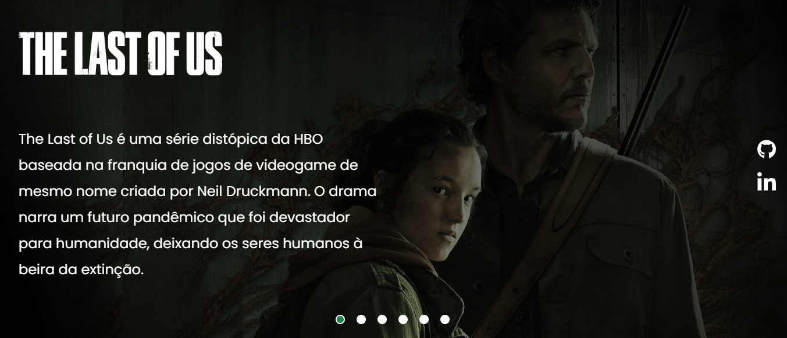

# The Last Of Us

Landing Page elaborada no evento Dev em Dobro, para praticar tecnologias como HTML, CSS, JavaScript e técnicas de responsividade.

 

Link: https://raphael-lima-the-last-of-us.netlify.app

## Minha aplicação:

## Tecnologias utilizadas:

<ul>

  <li>Design Responsivo</li>

  <li>JavaScript</li>

  <li>HTML</li>

  <li>CSS</li>

</ul>

## Sobre a aplicação:

Essa aplicação é uma Landing Page inspirada na série The Last Of Us com a funcionalidade de carrossel de imagens para praticar tecnologias como HTML, CSS, JavaScript e técnicas de responsividade.

## Ficaria feliz com Feedbacks:

Email: raphaeldesousalm@gmail.com  

LinkedIn: https://www.linkedin.com/in/raphaellima98/
